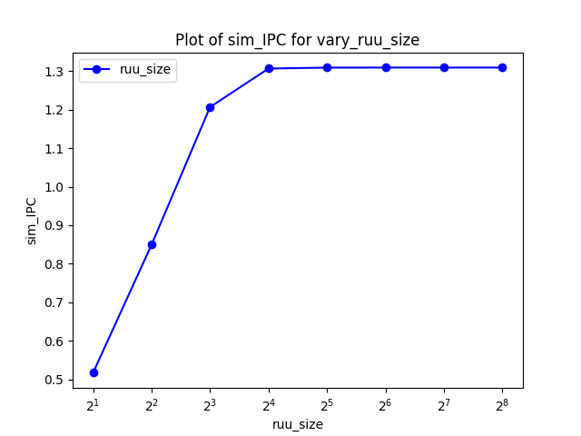
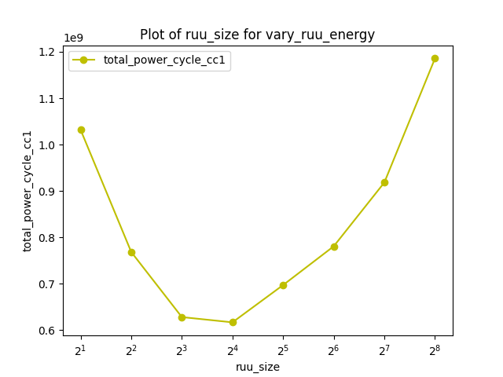
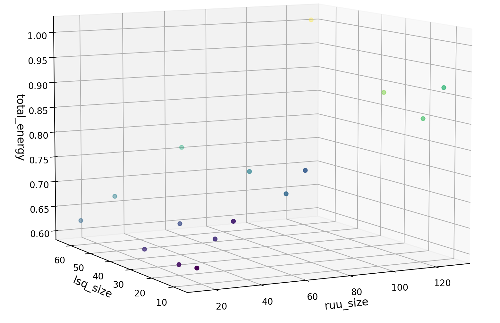
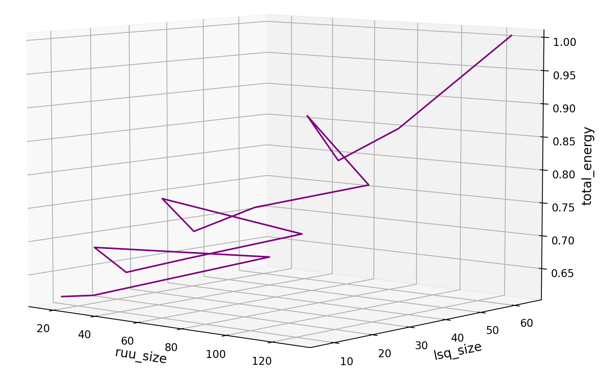
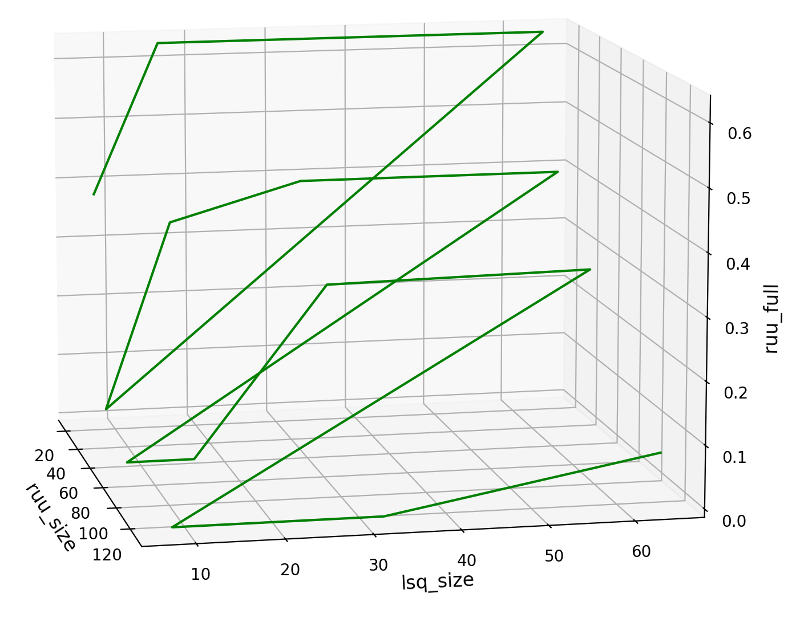
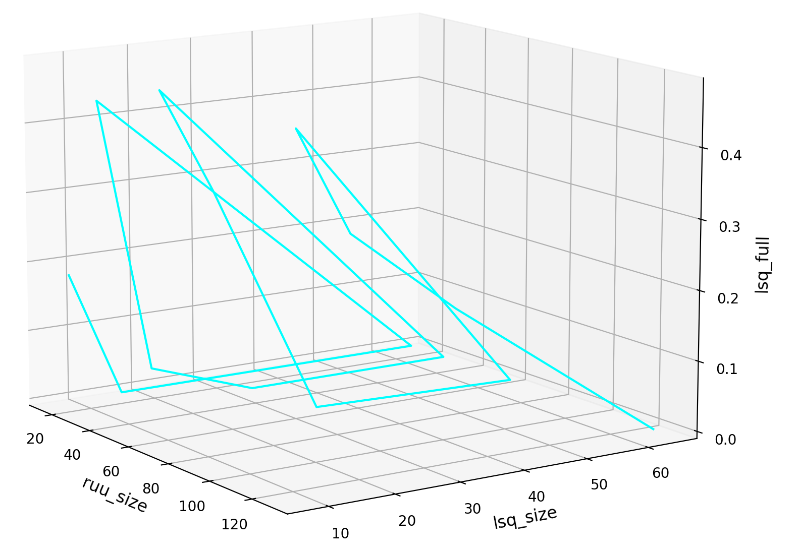
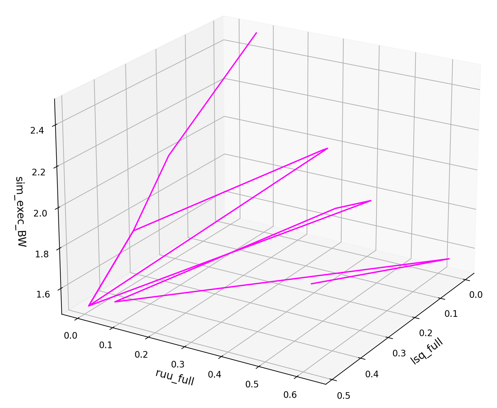

<h1 style="text-align:center">ACA Coursework 1 - Optimising Energy Usage of Randomly-walked SplayTrees</h1>
<h3 style="text-align:center; color: grey;">Pierce Wiegerling</h3>

## Program Analysis & Initial Thoughts
Splay Trees are designed to speed up element access for frequently-used elements, which lends itself well to having those elements cached, but the implementation and use-cases ultimately determine how deep the searches go and how often re-balancing, insertions, removals, etc. need to occur, which can be more expensive operations that don't play as nicely with caching or simple predictors. To better understand how to customise the architecture to this program, I've taken a look at all the test programs being run, and distilled some important information that I think will help inform my decisions.

#### `splaytest.c` (just analysing case '3' and `random_walk()`):
- two very large `for` loops (iterating over large ranges, easy-to-predict)
  - since one loop just inserts and one just queries, perhaps best to swap architectures halfway through...
  - a smaller bimodal predictor would deal with these loops pretty well
- very few arithmetic or memory accesses, mostly very consistent function calls
  - Return Address Stack could prove useful, small would be enough for this use case
- `random_walk()` functions are relatively low-cost, basic arithmetic and division by 2 (could be compiled to bitshift)
  - mainly a wrapper for [`__my_random()`](#__randomc-assuming-type_3)

#### `bounds-splay-tree.c`:
- very few loops (with one `while(1)`, likely compiled as an unconditional branch with exit branches), but many many non-looping branches
  - mostly hard-to-predict branches, may actually be favourable to just save on power and firm the mispredictions
  - in other words, race-to-finish seems implausible, due to the large number of mispredictions that I predict
- implementation of re-balancing stores _all_ tree pointers into a dynamically-allocated array
  - could endure the RAS-failure per rebalance, since most of the re-balancing impacts the cache
  - the dynamic allocation of pointers actually helps reduce need for huge recursive call stacks
- mix of short and long branches (conditional execution of few/many instructions before common instructions continue)
  - so mix of small and large misprediction penalties
  - loop conditions are pretty simple, so small RUU wouldn't be punished too harshly
- a lot of these branches alter pointers and other values in memory (Store/Load), so would have to wait before committing
  - this would somewhat punish a larger RUU size, so an optimal size should be found
  - this would actually favour strong store-to-load forwarding, so a larger LSQ could be favourable
- has several nested branches, which could lead to heavy misprediction squashing (tree traversal hard for a small/local-history predictor)
  - don't want to issue too many instructions per cycle, to mitigate effects of this
- in ideal case, query keys are close in value (advised by `DELTA`), which they _somewhat_ are (`DELTA` = 3)
  - relatively shallow searches, keeps the same few nodes near the root, _accommodating_ smaller predictors and smaller caches
- many function calls, where each function seems to be calling another function to perform a task
  - lots of calls -> lots of jumps and returns -> may need a slightly larger return address stack
- the recursive function calls occur either for shallow searches*

*searches should be shallow, since random walks should cause soon-to-be-accessed keys to always be zigged/zagged near the root of the tree

#### `__random.c` (assuming `TYPE_3`):
- Operates using a table of values (modified at runtime), allegedly uses primitive polynomials
- table indexing, then basic addition, bitshifting, and pointer arithmetic (to traverse tables)
  - indexed values would change, would do well with a decent-sized cache (l2 would be fine)
- a lot of the 'branches' should just be collapsed at compile-time (use of constants in conditions)
- only a couple of actual branches, with loops used only for initialising `__my_srandom` (onetime impact)
  - branches are quite short -> small misprediction penalty
- possibly high ALU-load at startup, then medium cache-load during operation (table is only 32 `long int`s wide: 128 bytes)
  - high-frequency read/write access to table, so using write-back is probably preferable to reduce memory accesses
  - since it's a table, a large block size is good, i.e. pulls in whole table in one line, so no preference on associativity
- called very frequently by all 3 types of [splaytest](#splaytestc-just-analysing-case-3-and-random_walk) (in loops)
  - so the needs of this program are very important to performance
 

#### `bounds-impl.h` (since it defined some functions):
- standard header file things: just some bound-checking, inline function definitions, and prototypes

#### `gettimemicroseconds.c`:
- used by splaytest's `case '3'` (the one we're using), not a really high-load function
- makes use of `vsyscall` (as described [here](https://stackoverflow.com/a/7269039)), to get the time, which is relatively low-impact
- then large multiplication (converting to microseconds), which could be high load on Mult. FU / ALU?

### Notes and Intial Guesses
My initial thoughts are that a minimal architecture that's just large enough to accomplish this task would make optimal use of allocated power, while trading off performance in speed. It's also worth noting, that no floating-point maths is explicitly performed, so all floating-point units could be removed (but this makes SimpleScalar sad). However, one point that makes Wattch sad* is inorder single-issuing of instructions, which I feel could be viable in this case, since branches would drop only one cycle, and a lot less power would be needed per cycle.\
TL;DR for [Program Analysis](#program-analysis--initial-thoughts):
- many concurrent ALUs would probably be a good idea (a couple MUL/DIV units would be enough)
- small branch predictor, with quick context-switching (probably just bimodal would be sufficient)
- update branch predictor after commit, since worried about mispredictions (but do test) 
- test a range of predictor sizes, see where is optimal for this particular program
- relatively large l2 cache, l1 needn't be excessive (or could try huge l1 and no l2?)
- cache doesn't need huge associativity, direct-mapped may even be fine
- keep number of issues per cycle around 4, don't set it too high, misprediction penalty would be painful
- test a variety of values for RUU size, optimal is likely somewhere in the middle
- strong store-to-load forwarding, probably not a small LSQ, test in conjunction with RUU size
- get yourself a decently large RAS to deal with all those nested function calls

*since it was mentioned that this wouldn't be reflected in the power consumption statistics from Wattch

I think one of the biggest contributors to power consumption will be branch mispredictions, since I feel like there will inevitably be a lot of them; I would argue that with large enough L1 and L2 caches, most of the working memory could be safely held in high-level memory, increasing cache power consumption, but reducing the need for expensive memory accesses; I believe a large RAS would be needed to help absorb the impact of all those recursive calls, but that, in turn, could affect the power consumed by the RAS (which will almost always be running).

## Answering questions set in Spec
### Varying RUU and LSQ Sizes
<table><tr>
  <td width=50%>
    
  </td>
  <td>
    
  </td>
</tr></table>

There appears to be a limit to just how many Instructions we can crank out Per clock Cycle by just increasing the size of the RUU; there is also the implication that after a certain size, anything larger offers no more performance benefits and simply serves to increase the overall power consumption (since cc1 accounts for the power usage of whole RUU, despite its underutilisation). As I predicted earlier, the optimal size of the RUU, in relation to power consumption seems to sit somewhere inbetween the two extremes offered by the script (2 to 256) for a default LSQ size of 8.

<table><tr>
  <td width=50%>
    
  </td>
  <td>
    
  </td>
</tr></table>

The relationship between LSQ and RUU sizes is quite interesting, as the power consumption seems to increase primarily as a result of RUU size: if you follow the line upwards, you'll notice that increasing the LSQ size does increase total power consumption, but not by too much, however, on each iteration of increasing the RUU size, there's steep jump in power consumption. This makes sense to me, since the RUU size is constantly running, power-hungry, and a much larger unit than the LSQ, holding all the instructions and operands while constantly monitoring the CDB for matching tags, whereas the LSQ just does cross-checks and comparisons within the Load-to-Store complex (which doesn't even need to be on if there aren't any stores in waiting).

One very interesting observation from these graphs (which may be hard to see in these snapshots), is that as LSQ is iterated over the power consumption seems to dip, consistently, at `LSQ size = 16`, which I think indicates that there could be a [bottleneck](#identifying-bottlenecks) there, that's being overcome by giving the LSQ a little more breathing room. Another interesting point, is for `RUU size = 64`, the behaviour of the increase in power consumption is quite interesting, where after `LSQ size = 32` the rate of increase of the power consumption seems to decrease for the next point (`LSQ size = 64`); however, to borrow a term from machine learning, this could also just be a case of me overfitting the data, so to take a closer look at these values, I took a look at the other values returned when I varied RUU and LSQ size, that could indicate the presence of bottlenecks.

#### Identifying Bottlenecks

<table><tr>
  <td width=50%>
    
  </td>
  <td>
    
  </td>
</tr></table>

The RUU seems to be being bottlenecked by the LSQ for smaller LSQ sizes (stalling at LSQ means instructions are waiting on load values and the RUU can't get the instructions in its buffer completed), allowing the RUU to escape being full more often. On the other hand, the LSQ seems to be affected less by the RUU size, where it's just consistently less full for larger sizes of LSQ (obviously). Though, the thing to notice is that with larger RUUs the LSQ has less downtime (it's more full more often), with only `LSQ size = 64` being able to mostly escape being full at all, once the `RUU size = 128`, which makes sense, since the RUU can issue more instructions, so it can issue more stores that the LSQ needs to hold between commits.

When comparing the two directly against the execution bandwidth (total number of instructions issued each cycle), we see that the best execution performance is achieved when the neither the RUU nor LSQ is full that much... Aside from the obvious point, we also notie that the RUU seems to be more crucial to execution bandwidth than the LSQ, since the gradients are steeper as RUU is altered. This also makes sense, since the RUU is the component actually issuing instructions, so when it's able to operate more freely, more instructions can be issued.

#### Should we Race-To-Finish?

The 3d energy consumption [diagrams](#varying-ruu-and-lsq-sizes) seem to indicate that it really is about finding the sweet spot, since the lowest power consumption was achieved with the closest RUU and LSQ size to the trough that we found in the 2d comparison of RUU size against power consumption. So, it does appear unfavourable to just pick the largest and most powerful options, due to the number of stalls and mispredictions that would be encountered (unless, of course, the predictor were perfect).

### Minimising to find sweet spot

Was planning on running a test with outorder and inorder keeping caches, branch predictors, and RAS size the same among both, with the main differences in the architecture reflecting the strengths of both strategies: 
- changing the issue and decode widths, as well as IFQueue to 1 for inorder 
  - to drop branch misprediction penalties down to 1 cycle stalls for relevant hardware components
- keeping all three of those at 4 for outorder
  - to allow for a good balance of parallelism but also not overload that strategy with too much hardware overhead

However, this is an error I receieved, on top of with the fact that there must be at least 1 FPALU and the EdStem posts about the innacuracies of 
`fatal: LSQ size must be a positive number > 1 and a power of two`

But, I did decide to reduce the number of ALUs and MUL units (2 each) in an effort to reduce the redundant hardware, since the default of 4 were likely being underutilised.

Apologies, but I do wish I had more time to spend on this, I think I spent too long analysing the programs, so had I had more time, I would've followed those suggestions to find a more efficient configuration.